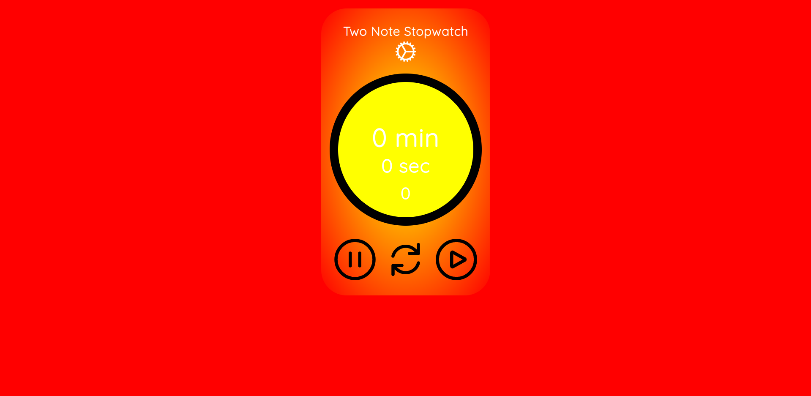
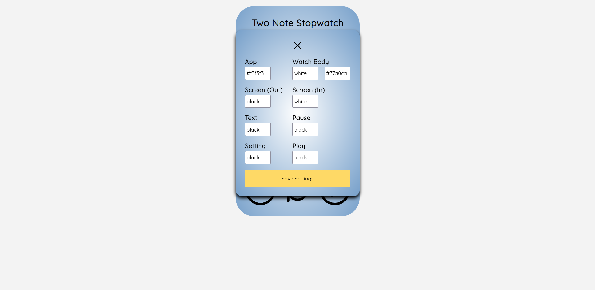
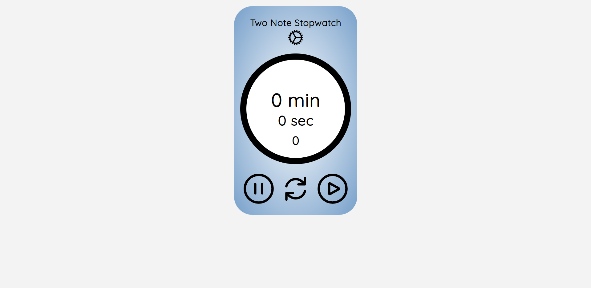

# Two-Note Stopwatch (v 2.0)

<a href='https://stopwatch-green-six.vercel.app/'>Click Here to Check it Out</a>

## Version 2 Preview
Very customizable.
</img>
</img>

## Verion 1 Preview
</img>

## About Project

Two-Note is a simplistic stopwatch that helps one tract time elapsed between events.

## Technologies Used

    </img>

## Features of v 1.0
 - User can start, reset and stop the stop watch.

 ## Features of v 2.0
 - User can adjust the applications appearance. As well as persist the changes in browser.