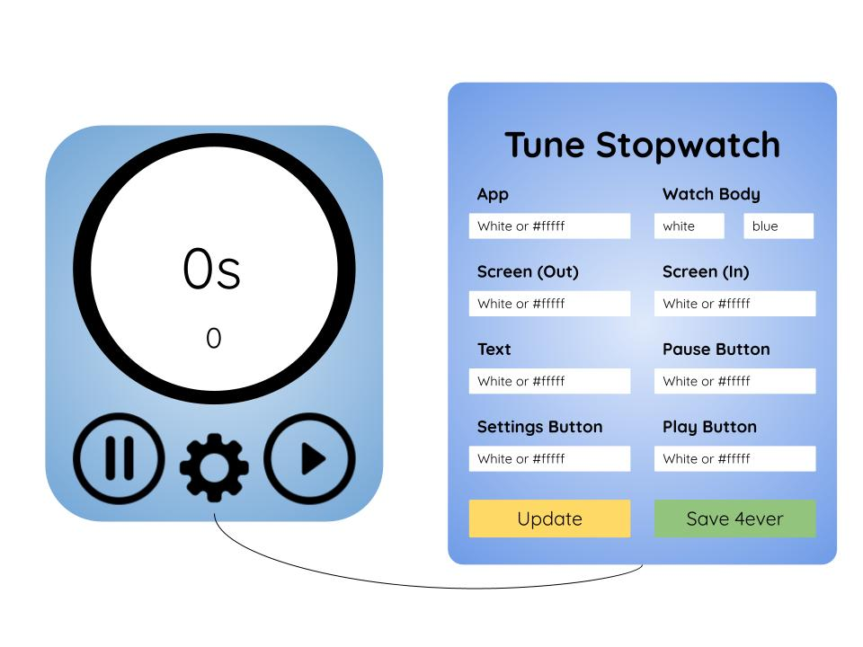

# Two-Note Stopwatch (v 1.0)

<a href='https://rode-clone-three.vercel.app/'>Click Here to Check it Out</a>

</img>

## About Project

Two-Note is a simplistic stopwatch that helps one tract time elapsed between events.

## Technologies Used

    </img>

## Features of v 1.0
 - User can adjust the applications appearance. As well as save the changes temporarily or permanently.
 - User can start and stop the stop watch.